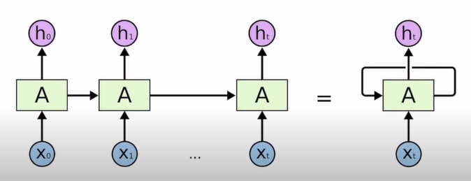
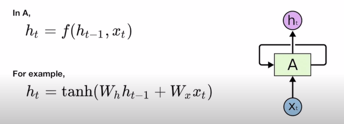
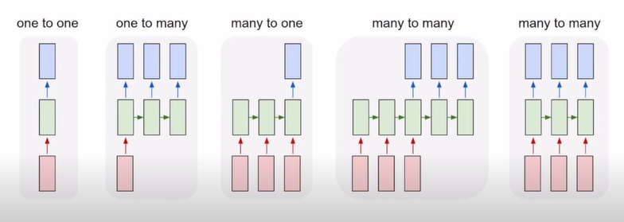

# Lecture 11-0

## RNN-intro

- 본 글은 모두를 위한 딥러닝 강좌를 듣고 공부 목적으로 작성된 게시물입니다.

RNN은 sequential data를 잘 다루기 위해 처음 도입되었다. sequential data란 data의 값뿐만 아니라 순서도 매우 중요한 의미를 가지는 데이터를 말한다. 순서가 중요하지 않다는 것은, 데이터가 들어오는 순서에 의해 결과가 바뀌지 않는 경우로, 이미지 분류가 대표적일 것이다. 그러면 data의 순서가 중요하다는 것은 무엇을 의미할까?

‘hello’를 생각해보자. 여기서 각각의 알파벳의 순서는 하나의 단어를 결정하는데 중요한 역할을 한다. 이런 경우에, 순서가 중요하다고 한다.

### (1) RNN의 구조

 어떠한 input값을 집어넣었을 때, 출력되는 값도 있고, 출력되지 않고 다음 셀로 넘어가는 값이 있다. 이러한 값을 hiddens state라고 한다. 따라서, 이 hidden state에 의해, 다음 셀에서는 이전 셀에서 처리한 결과를 반영하게 된다. ‘hello’를 예시로 들자면, ‘hello’에서는 l이 두번 나오기 때문에, 어떤 때는 ‘l’을 반환해야되고, 어떤 때는 ‘o’를 반환해야된다는 어려움이 있다. 하지만, rnn은 이전 셀의 결과도 반영할 수 있기 때문에, 이를 가능하게 해주는 것이다. 

 이 RNN의 장점은 모든 셀이 파라미터를 공유한다는 점이다. 즉 위의 예시에서는, A가 하나라는 것이다. 아무리 긴 sequence가 들어와도 A는 하나만 있으면 된다는 장점이 있다.

 다음은, A 안에서 어떠한 작업이 일어나는지 보인 그림이다. A를 어떻게 설계하느냐에 따라 다르겠지만, A는 기본적으로 함수 연산이다. 그리고 이 함수는 전 단계에서의 hidden state와 현 단계에서의 input값을 입력값으로 받는다.

### (2) RNN의 사용

 RNN은 입력값과 출력값을 어떻게 설계하느냐에 따라 굉장히 다양한 용도로 사용될 수 있다. one to one를 rnn이라 할 수 없으므로, one to many 경우부터 살펴보자. **One to Many**는 이미지를 받고, 그 이미지에 해당하는 자막을 출력하는 경우에 사용될 수 있을 것이다. **Many to one**은 문장을 받고, 이 문장에 숨겨진 감정을 출력하는 데 사용될 것이다. **Many to Many**는 문장을 받고, 문장이 출력되는 경우이다. 하지만 왼쪽의 many to many와 오른쪽의 many to many는 살짝 다르다. 왼쪽의 many to many는 문장을 끝까지 받은 후, 출력을 하는데 이는 번역에 많이 쓰인다. 오른쪽의 many to many는 비디오에 적용된다. 이미지가 들어올 때마다, 비디오를 출력하는 경우가 대표적이다.
